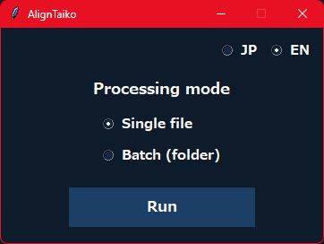
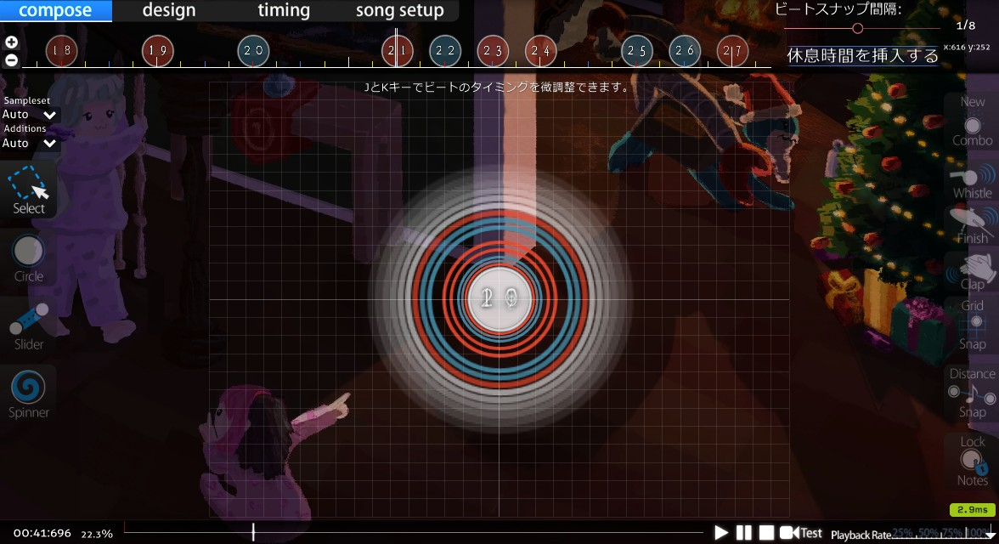

# AlignTaiko
<br>
<p align="left"></p>
<br>
<p align="left"></p>
<br>
全てのosu!taikoヒットオブジェクトを中心部に再配置します。<br>
Align all hit objects in osu!taiko to the center.
<br>
<br>
<p align="left"></p>
<br>
osu!taikoビートマップ用のHitObjects座標調整ツールです。<br>
This is a tool for adjusting hit objects coordinates for osu!taiko beatmaps.
<br>
<br>

## Download
[Download the latest Windows executable](https://github.com/calmeel/AlignTaiko/releases/tag/v1.2)

## Function
- Aligns the coordinates of all hit objects (excluding Sliders and Spinners) to `(256, 192)`

## Usage (exe)
1. Launch AlignTaiko.exe
2. Select the processing mode (single or batch)
3. Select the beatmap text file (.osu)
4. Choose the output folder
5. A file with the same name will be output

## Usage（Python）
```bash
python AlignTaiko.py
```
<br>

## ダウンロード
[Download the latest Windows executable](https://github.com/calmeel/AlignTaiko/releases/tag/v1.2)

## 機能
- SliderやSpinerを除く、全てのHitObjectsの座標を `(256, 192)` に揃えます

## 使い方（exe）
1. AlignTaiko.exe を起動
2. 処理モードを選択（単体 or 一括）
3. ビートマップのテキストファイル (.osu) を選択
4. 出力フォルダを選択
5. 同名ファイルが出力されます

## 使い方（Python）
```bash
python AlignTaiko.py
```
