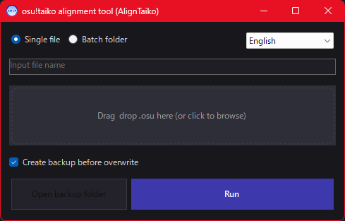
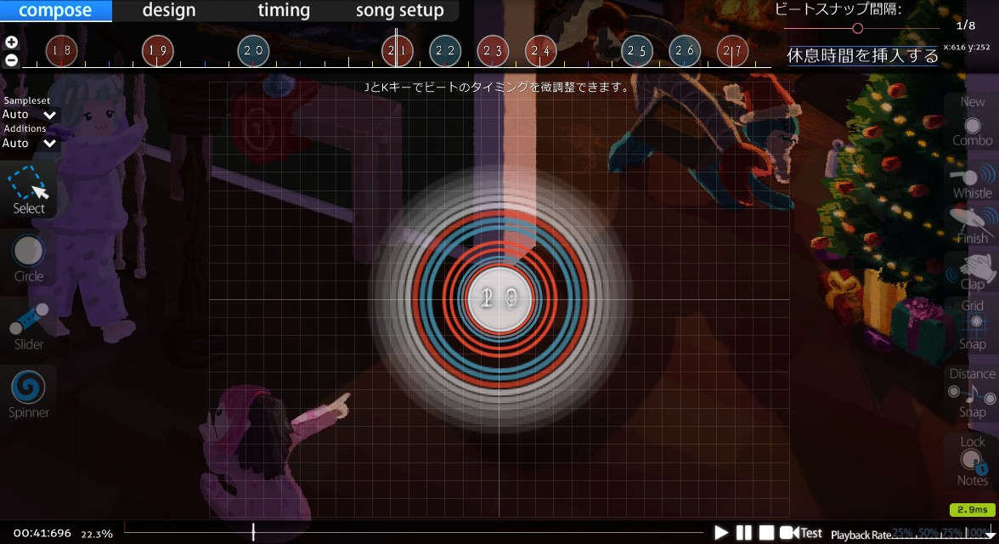

# AlignTaiko
 

 

 
Align all hit objects in osu!taiko to the center.
 
 

 

[日本語版のREADMEはこちら](README_JP.md)

## 📦 Download
[Download the latest Windows executable](https://github.com/calmeel/AlignTaiko/releases)

## ⚙️ Function
- Aligns the coordinates of all hit objects (excluding Sliders and Spinners) to `(256, 192)`

## 💡 Why is this tool useful?

- In **osu!lazer**, hit objects are always positioned at the center of the playfield.
- In **osu!stable**, hit objects can be placed at arbitrary coordinates.

While many **Ranked maps** are visually aligned to the center,  
**osu!stable does not provide a built-in way to realign hit objects in bulk**.

## ✨ Features

- **Single-file input**
  - Process one `.osu` file at a time
  - Clear and predictable behavior

- **Batch mode (non-recursive)**
  - When enabled, processes all `.osu` files in the same directory as the selected file
  - Subdirectories are intentionally ignored

- **Safe overwrite with automatic backup**
  - Original files are preserved using a temporary file + replace strategy
  - Backup can be enabled or disabled in the UI

## 🖥 System Requirements

- Windows 10 / 11 (x64)
- No .NET runtime installation required (self-contained build)

## 🚀 Usage

1. Launch `AlignTaiko.exe`
2. Drag & drop a `.osu` file into the window  
   *or* click the drop area to browse
3. Choose **Single** or **Batch** mode
4. Adjust options if needed (e.g. backup, language)
5. Run the process

In **Batch mode**, all `.osu` files in the same directory as the selected file will be processed.

## ⚠️ Notes

- Only hit objects of type **1** and **5** are modified  
  (sliders and spinners are intentionally excluded)

- Subdirectories are never processed

- A **backup folder is created inside the directory containing the `.osu` files**  
  Be sure to remove this folder before uploading maps.

- **Slider adjustments must be done manually**  
  This tool does not automatically modify slider shapes or control points.

- This tool does not access the internet or external services

## 🛠 Built With

- C#
- .NET 8
- WinForms

## 📄 License

This project is licensed under the MIT License.  
See the `LICENSE` file for details.

## 🔒 Privacy

AlignTaiko does not collect any personal data.  
All processing is done locally on your machine.

